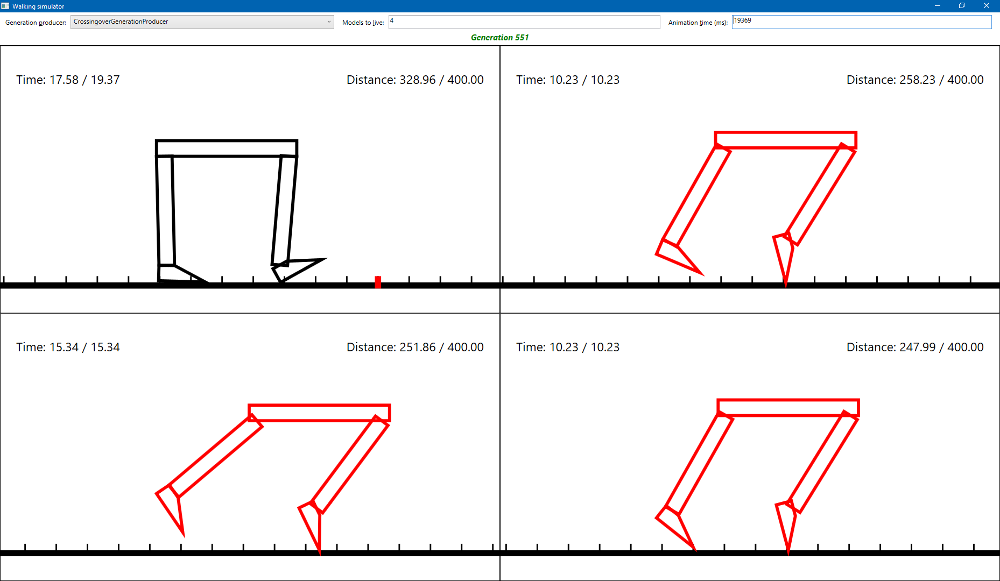

# Walking Simulator
Using evolution algorithms to learn abstract model to walk

The model is represented as two-legs creature. Its legs move between specified angles. At any time position of the leg (its angle) is determined by sum of periodic values, each of which is calculated as `K * sin(T0 + Speed * time)`, where:
* `K` is significance factor of current periodic value
* `T0` is initial angle of current periodic value
* `Speed` is a speed of change of current periodic value
* `time` is current time

The library is provided with 3 algorithms to produce new generation of walking models:
* Full random
* Random mutation of parent
* Combinations of different parents with crossingover operators with random mutations

The walking engine is provided with WPF visualizer to track evolution process:
